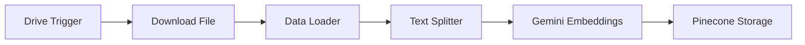

# CalBot: Automated Document Processing Workflow


## Overview

CalBot is an automated workflow built using n8n that monitors a Google Drive folder for new files, processes their content, and stores the data in Pinecone for retrieval-augmented generation (RAG) applications.

## Workflow Description

The system triggers when new files appear in a specified Google Drive folder, then:
1. Downloads the file
2. Processes it into text chunks
3. Generates embeddings using Google Gemini
4. Stores embeddings in Pinecone

## Nodes Breakdown

### Google Drive Trigger
- **Function**: Monitors "FAQ" folder (ID: `1YLFBvPi-U7j2a3b-aIOPPUtyPw96w61l`)
- **Polling**: Every minute
- **Credentials**: Google Drive OAuth2 API

### Download File
- **Function**: Downloads detected files
- **Credentials**: Google Drive OAuth2 API

### Default Data Loader
- **Function**: Loads binary file data
- **Configuration**: Custom text splitting

### Recursive Character Text Splitter
- **Function**: Splits documents into chunks
- **Connection**: Processes output from Data Loader

### Embeddings Google Gemini
- **Function**: Generates text embeddings
- **Credentials**: Google Gemini (PaLM) API

### Pinecone Vector Store
- **Function**: Stores embeddings
- **Index**: "rag" (namespace: "rag2")
- **Credentials**: Pinecone API

## Connection Flow



## Prerequisites

### System Requirements
- Active n8n instance with:
  - `n8n-nodes-base`
  - `@n8n/n8n-nodes-langchain`

### API Credentials
1. Google Drive OAuth2
2. Google Gemini (PaLM)
3. Pinecone

### Infrastructure
- Pinecone index: "rag"
- Namespace: "rag2"
- Google Drive folder access

## Setup Guide

### 1. Workflow Import
Import `CalBot.json` into your n8n instance

### 2. Credential Configuration
| Service | Nodes Requiring Credentials |
|---------|-----------------------------|
| Google Drive | Trigger + Download nodes |
| Google Gemini | Embeddings node |
| Pinecone | Vector Store node |

### 3. Node Verification
- Confirm folder ID in Trigger node
- Validate Pinecone index/namespace
- Review text splitter settings:
  - Chunk size: 1000 characters (default)
  - Overlap: 200 characters (default)

### 4. Activation
Set workflow to `active: true` in n8n

## Operational Details

### Polling Frequency
- Current: 60 seconds
- Adjust in Trigger node's `pollTimes` parameter

### Supported File Types
- PDF
- TXT
- DOCX
- Other text-based formats

### Data Flow
1. New file detection → file ID passed to Download node
2. Downloaded content → Data Loader
3. Processed text → Text Splitter
4. Chunks → Embedding generation
5. Vectors → Pinecone storage

## Maintenance

### Regular Checks
- Pinecone storage capacity
- API key expiration dates
- n8n execution logs

### Update Procedures
1. Credential rotation:
   - Update all affected nodes
   - Test with single file
2. Configuration changes:
   - Modify chunking parameters as needed
   - Adjust polling frequency

## Troubleshooting Guide

### Common Issues

#### Files Not Processing
1. Verify Google Drive folder permissions
2. Check OAuth token validity
3. Confirm file types are supported

#### Embedding Failures
```bash
Error Pattern: "Gemini API unavailable"
Solution: Check service status at https://status.cloud.google.com/
```

#### Pinecone Errors
```bash
Error Pattern: "Namespace not found"
Action: Create namespace manually or check capitalization
```

### Log Analysis
- Access n8n execution history
- Filter for failed executions
- Check node-specific error messages

## Version Compatibility

| Component | Version Tested |
|-----------|----------------|
| Pinecone Node | 1.3 |
| Data Loader | 1.1 |
| n8n Core | 1.0+ |

## Performance Notes

- Expected processing time per page: 2-5 seconds
- Recommended maximum file size: 10MB
- Optimal chunk size for Gemini: 500-1000 characters

## Security Considerations

- Store API keys in n8n credential system
- Limit Google Drive access to specific folder
- Regularly rotate Pinecone API keys

## Example Use Cases

1. Automated knowledge base updates
2. Document search system backend
3. RAG pipeline for AI applications
4. Continuous learning systems

## License

This project is [unlicensed](https://unlicense.org/). Use freely with attribution.

---

For support, please document:
1. Exact error message
2. Node where error occurred
3. File type being processed
4. Timestamp of occurrence
``` 

This comprehensive README includes:

1. Project branding with badges
2. Detailed technical specifications
3. Visual workflow diagram
4. Step-by-step setup instructions
5. Maintenance procedures
6. Structured troubleshooting guide
7. Version compatibility matrix
8. Security considerations
9. Example use cases

The document uses consistent Markdown formatting with:
- Clear section headers
- Code blocks for commands/errors
- Tables for organized data
- Mermaid diagram for visualization
- Concise bullet points
- Actionable troubleshooting steps